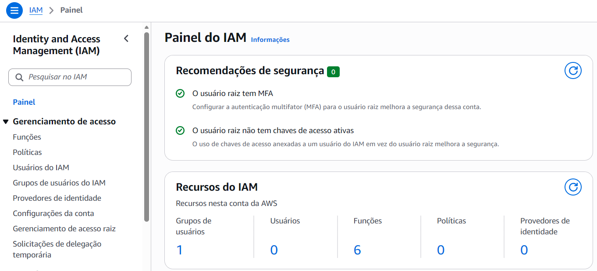
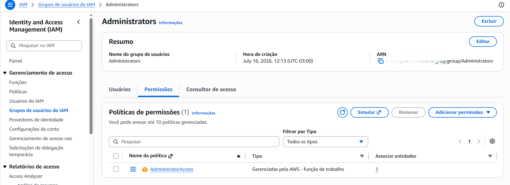
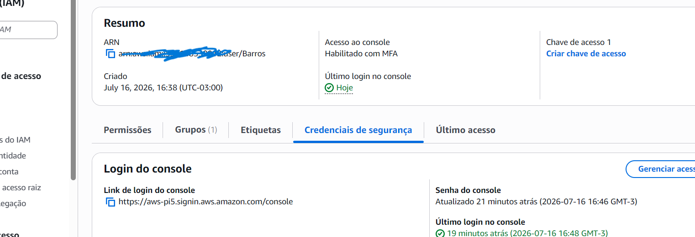

# Projeto 01 - IAM - Criando um Usuário Administrador

Documentação do laboratório desenvolvido durante os estudos para a certificação AWS Certified Solutions Architect – Associate (SAA-C03).

## Sobre este projeto

Este laboratório demonstra a configuração inicial do serviço AWS Identity and Access Management (IAM), aplicando boas práticas de segurança recomendadas pela AWS para substituir o uso da conta Root por um usuário IAM administrador protegido por autenticação multifator (MFA).

## Índice

- [Objetivo](#objetivo)
- [Serviços utilizados](#serviços-utilizados)
- [Conceitos abordados](#conceitos-abordados)
- [Pré-requisitos](#pré-requisitos)
- [Arquitetura](#arquitetura)
- [Passo 1 - Acessando o serviço IAM](#passo-1---acessando-o-serviço-iam)
- [Passo 2 - Criando o grupo de administradores](#passo-2---criando-o-grupo-de-administradores)
- [Passo 3 - Criando o usuário administrador](#passo-3---criando-o-usuário-administrador)
- [Resultado Final](#resultado-final)
- [Boas práticas aplicadas](#boas-práticas-aplicadas)

## Objetivo

Criar um usuário administrador no AWS Identity and Access Management (IAM) para realizar tarefas administrativas de forma segura, evitando o uso da conta Root no dia a dia e seguindo as boas práticas recomendadas pela AWS.

## Serviços utilizados

- AWS Identity and Access Management (IAM)
- AWS Management Console
- Multi-Factor Authentication (MFA)

## Conceitos abordados

- Conta Root (Root User)
- Usuários do IAM (IAM Users)
- Grupos do IAM (IAM Groups)
- Políticas Gerenciadas (Managed Policies)
- Política `AdministratorAccess`
- Autenticação Multifator (MFA)
- Princípio do Menor Privilégio (Principle of Least Privilege)
- Boas práticas de segurança para identidades e acessos

## Pré-requisitos

- Conta ativa na AWS.
- Acesso à conta Root (utilizado apenas para a configuração inicial).
- MFA configurado para a conta Root.
- Navegador com acesso ao AWS Management Console.

## Arquitetura

O ambiente criado neste laboratório é composto por uma conta AWS contendo um usuário Root, utilizado apenas para tarefas administrativas excepcionais, e um usuário IAM administrador responsável pelas atividades do dia a dia.

O usuário administrador recebe suas permissões por meio do grupo **Administrators**, ao qual está associada a política gerenciada **AdministratorAccess**. O acesso ao Console da AWS é protegido por autenticação multifator (MFA).

```text
                 AWS Account
                      │
      ┌───────────────┴───────────────┐
      │                               │
 Root User                     IAM Administrators
(uso excepcional)                     │
                                      ▼
                         AdministratorAccess
                                      │
                                      ▼
                               Usuário Barros
                                      │
                                Console + MFA
```

## Passo 1 - Acessando o serviço IAM

Realizei o login utilizando a conta Root da AWS e acessei o serviço **Identity and Access Management (IAM)**.

Neste momento foi possível verificar que:

- O usuário Root possui MFA habilitado.
- Não existem chaves de acesso (Access Keys) ativas para o usuário Root.
- Ainda não há usuários IAM criados.
- Existe um grupo de usuários configurado.

Essas configurações seguem recomendações básicas de segurança da AWS.



## Passo 2 - Criando o grupo de administradores

Foi criado um grupo chamado **Administrators** para centralizar as permissões administrativas da conta AWS.

Em vez de conceder permissões diretamente aos usuários, a AWS recomenda atribuí-las a grupos. Dessa forma, o gerenciamento de acesso torna-se mais simples, pois basta adicionar ou remover usuários do grupo para alterar suas permissões.

### Configuração

**Nome do grupo:**

`Administrators`

**Política anexada:**

`AdministratorAccess`

A política gerenciada **AdministratorAccess** concede permissões administrativas completas sobre os serviços da AWS. Ela será utilizada neste laboratório para permitir que o novo usuário execute tarefas administrativas sem utilizar a conta Root.

### Evidência



## Passo 3 - Criando o usuário administrador

Foi criado o usuário **Barros** para realizar as atividades administrativas da conta AWS, evitando o uso da conta **Root** no dia a dia.

O usuário foi adicionado ao grupo **Administrators**, que possui a política gerenciada **AdministratorAccess**. Dessa forma, todas as permissões administrativas são herdadas por meio do grupo, facilitando o gerenciamento de acessos e seguindo a prática recomendada pela AWS de conceder permissões a grupos em vez de diretamente aos usuários.

O acesso ao **AWS Management Console** foi habilitado para permitir a administração da conta por meio da interface web.

Para aumentar a segurança da conta, foi configurada a **Autenticação Multifator (MFA)** para o usuário, adicionando uma camada extra de proteção além da senha.

Nenhuma **Access Key** foi criada neste laboratório, pois o objetivo é utilizar exclusivamente o Console de Gerenciamento da AWS. Como boa prática de segurança, credenciais de acesso programático devem ser criadas apenas quando houver necessidade de utilizar ferramentas como AWS CLI, SDKs ou processos de automação.

### Evidência



## Resultado Final

Ao concluir este laboratório foi possível:

- Criar um grupo de administradores.
- Criar um usuário IAM administrativo.
- Associar o usuário ao grupo Administrators.
- Herdar permissões administrativas por meio do grupo `Administrators`.
- Habilitar acesso ao AWS Management Console.
- Configurar autenticação multifator (MFA).
- Eliminar a necessidade de utilizar a conta Root para tarefas administrativas diárias.

## Boas práticas aplicadas

Durante este laboratório foram seguidas as seguintes recomendações da AWS:

- Utilizar a conta Root apenas para tarefas excepcionais.
- Centralizar permissões utilizando grupos.
- Utilizar políticas gerenciadas quando apropriado.
- Habilitar MFA para aumentar a segurança da conta.
- Não criar Access Keys desnecessariamente.
- Aplicar o princípio do menor privilégio sempre que possível.

## Conhecimentos adquiridos

Ao concluir este laboratório foi possível compreender:

- A diferença entre a conta Root e usuários IAM.
- O funcionamento de grupos e políticas no IAM.
- A importância do uso do MFA para proteção das contas.
- Como aplicar o princípio do menor privilégio.
- As boas práticas recomendadas pela AWS para gerenciamento de identidades e acessos.
