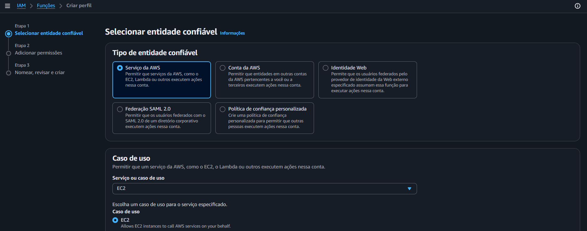
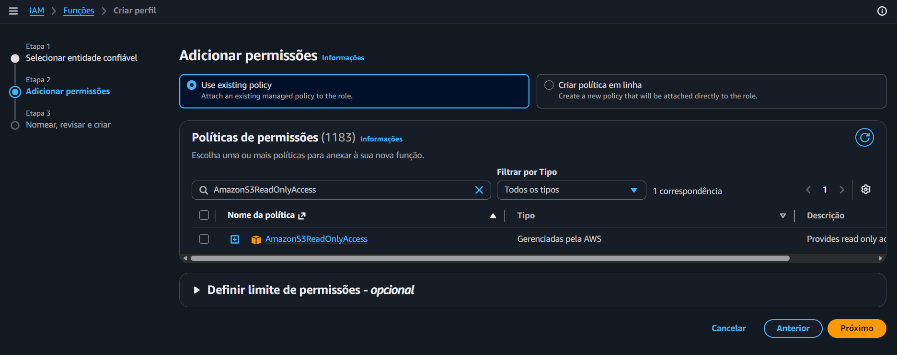
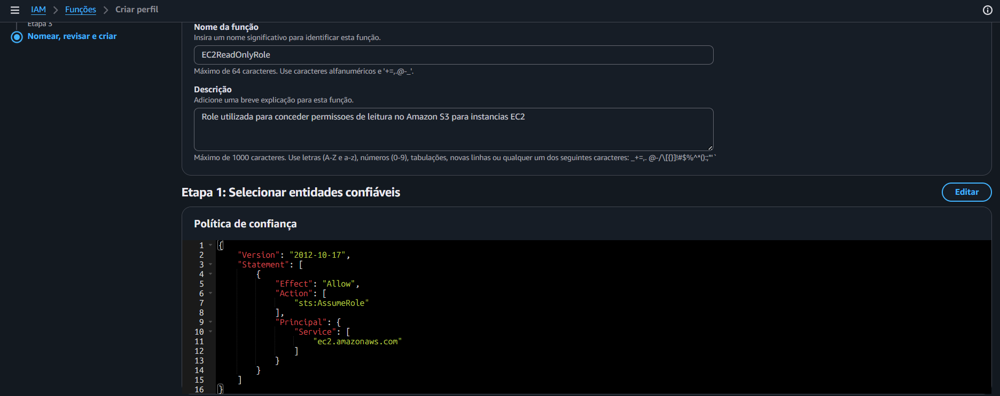
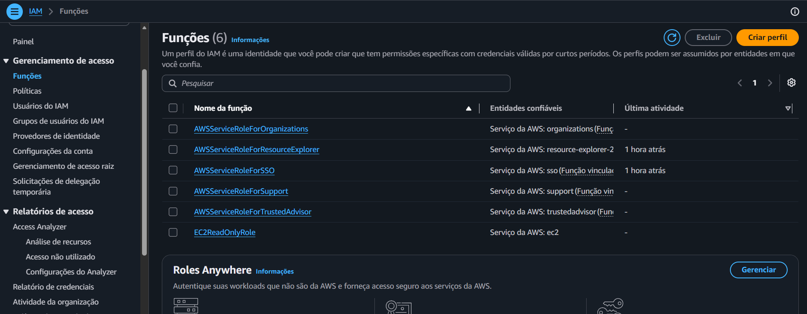

# Projeto 03 - IAM - Roles

Documentação do laboratório desenvolvido durante os estudos para a certificação **AWS Certified Solutions Architect – Associate (SAA-C03)**.

---

## Sobre este projeto

Este laboratório apresenta o funcionamento das **IAM Roles** no **AWS Identity and Access Management (IAM)**, demonstrando como criar uma função (Role), definir uma entidade confiável (Trusted Entity), associar permissões por meio de políticas gerenciadas e compreender o uso de credenciais temporárias fornecidas pelo **AWS Security Token Service (AWS STS)**.

Durante o laboratório foi criada uma Role para o serviço **Amazon EC2**, utilizando a política gerenciada **AmazonS3ReadOnlyAccess**, permitindo compreender como serviços da AWS assumem permissões sem a utilização de credenciais permanentes.

---

## Índice

- [Objetivo](#objetivo)
- [Serviços utilizados](#serviços-utilizados)
- [Conceitos abordados](#conceitos-abordados)
- [Pré-requisitos](#pré-requisitos)
- [Arquitetura](#arquitetura)
- [Passo 1 - Acessando o serviço IAM Roles](#passo-1---acessando-o-serviço-iam-roles)
- [Passo 2 - Criando uma IAM Role](#passo-2---criando-uma-iam-role)
- [Passo 3 - Analisando a Role criada](#passo-3---analisando-a-role-criada)
- [Passo 4 - Revisando a configuração da Role](#passo-4---revisando-a-configuração-da-role)
- [Resultado Final](#resultado-final)
- [Boas práticas aplicadas](#boas-práticas-aplicadas)
- [Conhecimentos adquiridos](#conhecimentos-adquiridos)
- [Referências](#referências)

---

## Objetivo

Compreender o funcionamento das **IAM Roles**, aprendendo como elas concedem permissões temporárias para serviços da AWS sem a necessidade de utilizar usuários IAM ou credenciais permanentes.

---

## Serviços utilizados

- AWS Identity and Access Management (IAM)
- AWS Security Token Service (AWS STS)
- Amazon EC2

---

## Conceitos abordados

- IAM Roles
- Trusted Entity
- AWS Services
- Permission Policies
- Trust Policies
- AWS STS
- Temporary Credentials
- AssumeRole
- Principle of Least Privilege (Princípio do Menor Privilégio)

---

## Pré-requisitos

- Conta AWS ativa.
- Projeto 01 concluído.
- Projeto 02 concluído.
- Usuário IAM **Barros**.
- Grupo **Administrators**.
- MFA habilitado.

---

## Arquitetura

Neste laboratório foi criada uma IAM Role destinada ao serviço Amazon EC2. A Role recebe permissões por meio da política gerenciada **AmazonS3ReadOnlyAccess** e poderá ser assumida pelo serviço EC2 através do AWS STS.

```text
                 AWS Account
                      │
      ┌───────────────┴────────────────┐
      │                                │
      ▼                                ▼
 Amazon EC2              IAM Role (EC2-S3-ReadOnly-Role)
                                   │
                    Trust Policy (EC2 Principal)
                                   │
                           sts:AssumeRole
                                   │
                                   ▼
                   AWS Security Token Service
                             (AWS STS)
                                   │
                    Temporary Credentials
                                   │
                                   ▼
              Permission Policy
          AmazonS3ReadOnlyAccess
                                   │
                                   ▼
                     Amazon S3 Bucket
```

---

# Passo 1 - Acessando o serviço IAM Roles

Foi acessado o serviço **AWS Identity and Access Management (IAM)** e selecionada a seção **Roles**, onde são gerenciadas as funções utilizadas por serviços, aplicações e usuários para obtenção de permissões temporárias.

### Evidência



---

# Passo 2 - Criando uma IAM Role

Foi criada uma nova **IAM Role** para o serviço **Amazon EC2**.

Como política de permissões foi utilizada a política gerenciada **AmazonS3ReadOnlyAccess**, permitindo que futuras instâncias EC2 possam acessar buckets do Amazon S3 somente em modo leitura.

Durante a criação também foi definido:

- Trusted Entity: AWS Service
- Serviço: Amazon EC2
- Política: AmazonS3ReadOnlyAccess
- Nome da Role: EC2-S3-ReadOnly-Role

### Evidência



---

# Passo 3 - Analisando a Role criada

Após a criação da Role foi realizada uma análise de suas configurações.

Foi possível observar:

- Nome da Role.
- ARN da Role.
- Política de permissões anexada.
- Trusted Entity.
- Trust Policy.
- Informações gerais da função.

Também foi possível compreender que uma IAM Role não possui senha nem Access Keys permanentes.

Quando utilizada por um serviço AWS, como uma instância EC2, a Role é assumida por meio da ação **sts:AssumeRole**, fazendo com que o **AWS Security Token Service (STS)** forneça credenciais temporárias.

### Evidência



---

# Passo 4 - Revisando a configuração da Role

Foi realizada a revisão das configurações finais da Role para validar sua criação e confirmar a associação da política de permissões.

Essa etapa permitiu compreender como uma Role reúne dois componentes fundamentais:

- **Trust Policy**, responsável por definir quem pode assumir a Role.
- **Permission Policy**, responsável por definir quais ações serão permitidas após a Role ser assumida.

### Evidência



---

## Resultado Final

Ao concluir este laboratório foi possível:

- Criar uma IAM Role.
- Configurar uma Trusted Entity.
- Associar uma política gerenciada à Role.
- Compreender a diferença entre Trust Policy e Permission Policy.
- Entender como o AWS STS fornece credenciais temporárias para serviços da AWS.
- Identificar o funcionamento da ação **sts:AssumeRole**.

---

## Boas práticas aplicadas

Durante este laboratório foram seguidas as seguintes recomendações da AWS:

- Utilizar IAM Roles em vez de credenciais permanentes para serviços da AWS.
- Evitar o uso de Access Keys em instâncias EC2.
- Conceder apenas as permissões necessárias.
- Utilizar políticas gerenciadas quando apropriado.
- Aplicar o princípio do menor privilégio.
- Documentar todas as configurações realizadas.

---

## Conhecimentos adquiridos

Ao concluir este laboratório foi possível compreender:

- Diferença entre IAM User e IAM Role.
- Funcionamento das IAM Roles.
- Trusted Entity.
- Permission Policy.
- Trust Policy.
- AWS Security Token Service (STS).
- Credenciais temporárias.
- Funcionamento da ação **sts:AssumeRole**.
- Aplicação das Roles em serviços como Amazon EC2.

---

## Referências

- AWS Identity and Access Management User Guide
- IAM Roles
- IAM Policies
- AWS Security Token Service (STS)
- AWS Security Best Practices
